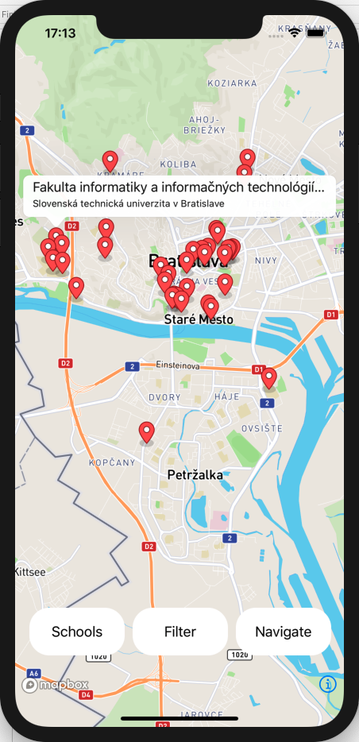
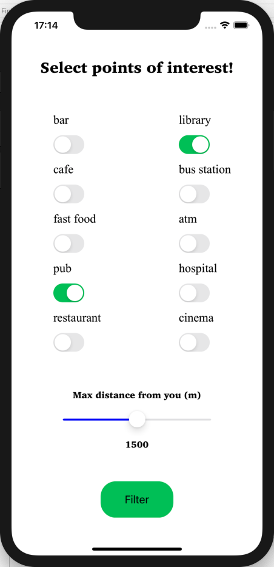
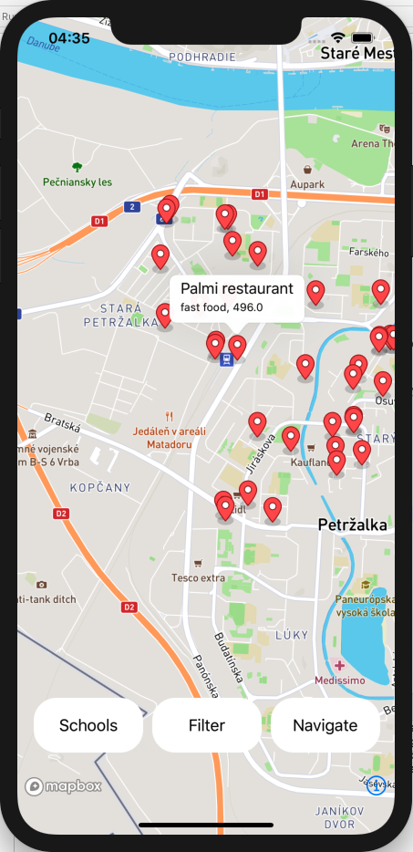
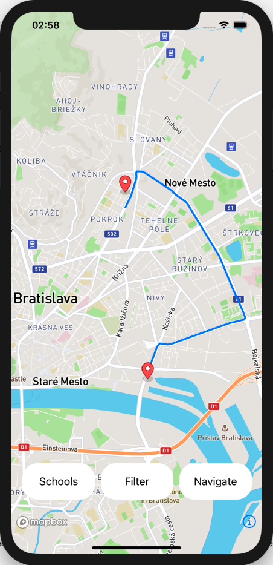

# Students app

## Overview

The application is designed for university students (specifically for the city of Bratislava) who do not know where and how to spend time after the end of school duties during the day or need some place near their school. The application provides the possibility to display all high schools in Bratislava. The student chooses a specific high school (where they study or where they want to look) and then choose the type of place they want to visit / search. After selecting a specific location he has the option of navigating to that location from his school. App will show directions to this place.

## Screenshots

### High schools on map
After School button pressed all high schools in Bratislava are displayed. A data about high school are name and school operator.



### Filtering points of interest
After selecting high school and pressing Filter button user is alowed to filter points of interest.



### Points of interest on map
After filtering points of interest user can choose destination where he wants to go. A data about point of interest are name, type and distance.



### Route on map
After selecting point of interest and pressing Navigate button the route is displayed.



## Architecture

### Backend

Backend is implemented in Node.js. It uses Express and Pg.
<br />**Express:** Web application framework that provides a Rest api.
<br />**Pg:** It allows web application connect to database.

Also at backend there is database running. I used two extensions: postgis a pgrouting. Data are from Open Street Maps.
<br />**postgis:** It adds support for geographic objects and allowing location queries.
<br />**pgrouting:** It is used to provide routing functionality

### Frontend
I developed mobile application in Swift programming language. Swift is developing language for iOS applications. I used Mapbox to work with map, whiich was installed into app by using CocoaPods.

## Api with queries

### ``GET /school``
It returns all high schools in Bratislava. 

**Query**
```
select a.name, (case when a.operator is null then 'Unknown' else a.operator end), st_asgeojson(st_transform(st_centroid(a.way), 4326))::json from ((select name, operator, way from planet_osm_polygon where amenity = 'university' and name is not null) union (select name, operator, way from planet_osm_point where amenity = 'university' and name is not null)) as a;
```

**Result**
```
{
    "name": "Vysoká škola manažmentu / City University of Seattle",
    "operator": "Unknown",
    "st_asgeojson": {
        "type": "Point",
        "coordinates": [
            17.097518905,
            48.116891157
        ]
    }
},
```

### ``POST /filter``
It returns all point of interest near selected school. Data as type of point of interest and distance from school are send through body. 

**Body**
```
{"school" : "Fakulta informatiky a informačných technológií STU",
"distance" : 1500,
"bar" : true,
"cafe" : false,
"fast_food" : false,
"pub" : false,
"restaurant" : true,
"library" : true,
"bus_station" : false,
"atm" : true,
"hospital" : false,
"cinema" : true}
```

**Query**
```
select b.name, b.amenity, st_distance(st_transform(a.way, 4326)::geography, st_transform(b.way, 4326)::geography), st_asgeojson(st_transform(st_centroid(b.way), 4326))::json from (((select name, amenity, way from planet_osm_polygon where name = 'Fakulta informatiky a informačných technológií STU')) union (select name, amenity, way from planet_osm_point where name = 'Fakulta informatiky a informačných technológií STU')) as a, (select * from planet_osm_point where amenity = 'bar' or amenity = 'restaurant' or amenity = 'library' or amenity = 'atm' or amenity = 'cinema') as b where st_dwithin(st_transform(a.way, 4326)::geography, st_transform(b.way, 4326)::geography, 1500) and b.name is not null order by 3 asc limit 150;
```

**Result**
```
{
    "name": "Mlynská Koliba",
    "amenity": "restaurant",
    "st_distance": 35.74237553,
    "st_asgeojson": {
        "type": "Point",
        "coordinates": [
            17.0722601,
            48.1547198
        ]
    }
},
```

### ``POST /route``
It returns route from school to selected point of interest.

**Body**
```
{"src_latitude" : 48.157758,
"src_longitude" : 17.12,
"dsst_latitude" : 48.141662,
"dst_longitude" : 17.104128}
```

**Query**
```
select st_asgeojson(st_transform(the_geom, 4326))::json from pgr_dijkstra('select id, source, target, st_length(the_geom, true) as cost from roads',(select source from roads order by st_distance(st_startpoint(the_geom), st_setsrid(st_makepoint(17.12, 48.157758), 4326),true) asc limit 1),(select source from roads order by st_distance(st_startpoint(the_geom), st_setsrid(st_makepoint(17.104128, 48.141662), 4326),true) asc limit 1)) as pt join roads rd on pt.edge = rd.id;
```

**Result**
```
{
    "st_asgeojson": {
        "type": "LineString",
        "coordinates": [
            [
                17.1200439,
                48.1577053
            ],
            [
                17.1203316,
                48.157716
            ],
            [
                17.1203859,
                48.157718
            ],
            [
                17.1204718,
                48.1577212
            ]
        ]
    }
},
```

## Instalation guide
1.  Clone project
2.  Run Rest api: api/index.js  ``$ node index.js``
3.  Open app/app.xcworkspace in Xcode

## Technologies

### Backend (Restapi, Database)
Node.js, Express, Pg, PostgreSQL, Postgis, Pgrouting, osm2pgsql

### Frontend (Mobile app)
Swift, CocoaPods, Mapbox

## Optimalization

For optimalization I make few indicies.
<br />
<br />``CREATE INDEX polygon_name_idx ON planet_osm_polygon (name);``
<br />``CREATE INDEX point_name_idx ON planet_osm_point (name);``
<br />``CREATE INDEX polygon_amenity_idx ON planet_osm_polygon (amenity);``
<br />``CREATE INDEX point_amenity_idx ON planet_osm_point (amenity);``
<br />
<br />Execution time before optimalization 30ms, after optimalization 12ms
